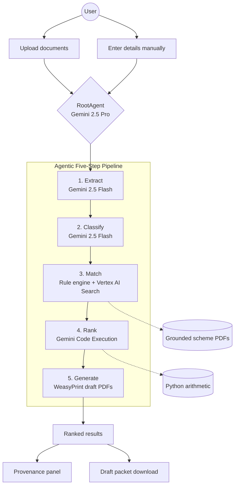
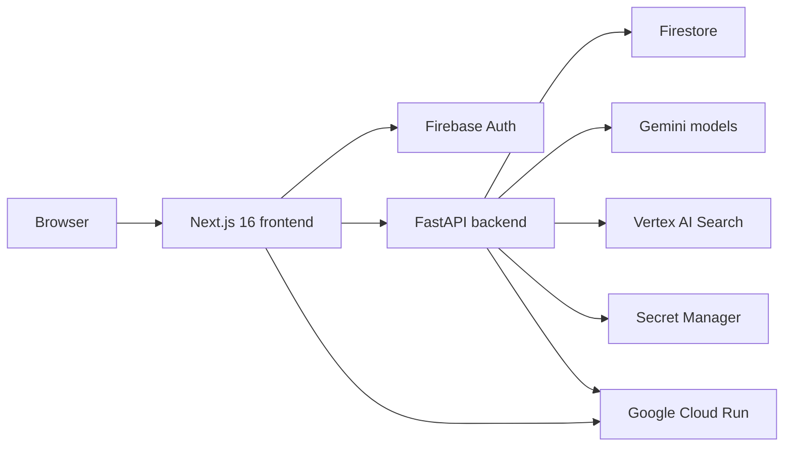
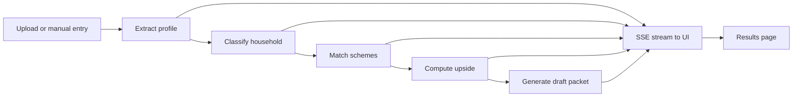
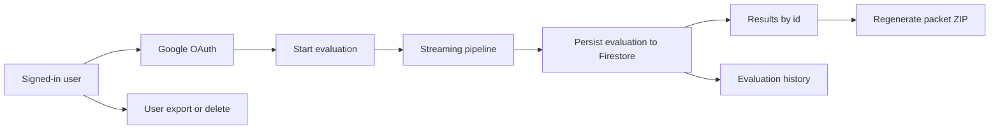

# Layak

Layak is an agentic AI concierge that helps Malaysians discover social-assistance schemes they may qualify for, estimate annual upside, and generate draft application packets with visible provenance.

> Project 2030: MyAI Future Hackathon submission  
> Track 2: Citizens First (GovTech and Digital Services)  
> Category: Open

## Functional Diagram



## Hackathon Submission Context

Layak is a public web application built for the Project 2030: MyAI Future Hackathon under Track 2, `Citizens First`. The project targets the `Open Category` and is designed to satisfy the handbook's emphasis on practical AI, grounded workflows, and deployment on Google Cloud Run.

The repository includes source code, setup instructions, architecture diagrams, deployment references, and AI disclosure details so judges and contributors can review the system end to end.

## What Layak Does

Malaysia's aid landscape is fragmented across agencies, forms, and portals. A citizen who may qualify for multiple schemes often has to discover each one separately, understand different eligibility rules, and resubmit the same information multiple times.

Layak reduces that friction into one guided flow. A user can either upload supporting documents or use a privacy-first manual entry path, then receive:

- matched schemes ranked by estimated annual value
- plain-language reasons they appear to qualify
- source-linked provenance for rule-backed claims
- downloadable draft application packets that the user can submit manually

The app is intentionally draft-only. It does not submit to government systems on the user's behalf.

## Why It Matters

Layak is built around a simple product stance: citizens should not have to portal-hop just to discover what they are already entitled to. The system focuses on a safer AI pattern than a generic chatbot by grounding eligibility logic in committed source materials, surfacing citations in the UI, and stopping at draft generation instead of live submission.

That combination matters for public trust and hackathon relevance. The goal is not to replace agency decision-making, but to make discovery, preparation, and confidence dramatically better for the user while demonstrating a practical, visible "AI to action" workflow.

## Solution Overview

Layak combines a Next.js frontend with a FastAPI backend and an agent pipeline that processes user information through five visible stages:

1. extract profile data from uploaded documents or prepare the profile from manual entry
2. classify the household context
3. match against supported schemes and relief rules
4. compute estimated annual upside
5. generate draft packets and return results

The pipeline streams progress back to the UI so the user can see the workflow instead of waiting on a black box.

## Features

- Document upload flow for IC, income, and utility files
- Manual entry mode for users who prefer not to upload sensitive documents
- Ranked eligibility results ordered by estimated annual RM upside
- Source-backed provenance for rule-driven outputs
- Draft packet generation for supported schemes and tax-relief summaries
- Google sign-in, user dashboard, and persisted evaluation history
- Free-tier quota controls with upgrade waitlist flow
- PDPA-aligned user export and account deletion endpoints
- Demo personas and fixture documents for stable walkthroughs and judging

## Architecture at a Glance

Layak is a two-service application. The frontend handles the public experience, authenticated dashboard, and streaming result views. The backend owns the intake APIs, authentication checks, scheme evaluation logic, PDF generation, and persistence. Google AI services power the extraction, orchestration, retrieval, and reasoning layers, while Firebase provides identity and stored evaluation history for authenticated usage.

## High-Level Architecture

### System Topology



### Agent Pipeline



### Authenticated Evaluation Flow



## Google AI Ecosystem

Layak is built around the Google AI ecosystem required by the hackathon handbook.

- `Gemini` powers multimodal extraction, classification, orchestration, and explanation generation.
- `Google ADK for Python` structures the backend agent workflow around the RootAgent and tool-driven pipeline.
- `Vertex AI Search` supports grounded retrieval over committed scheme source documents.
- `Gemini Code Execution` is used for visible computation of annual upside, with a backend fallback when needed.
- `Google Cloud Run` hosts the frontend and backend services.
- `Secret Manager` protects runtime secrets for deployment.
- `Firebase Auth` and `Firestore` support authenticated user flows, saved evaluations, quotas, and user-data actions.

## Privacy and Safety

- Layak does not submit to live government portals.
- Outputs are clearly draft-only and meant to help users prepare, not bypass agency review.
- Rule-backed claims are designed to surface provenance rather than asking users to trust a hidden AI decision.
- Uploaded documents are processed for evaluation, while authenticated product flows persist evaluation records and user account data needed for history, quota, and PDPA actions.
- The product includes export and deletion capabilities for signed-in users.
- Demo documents in the repository are synthetic and intended for demonstrations only.

## AI Disclosure

In line with the hackathon handbook requirement to disclose AI-generated code and AI-assisted development, this project used AI tooling in the following ways:

- `Google AI Studio` for prompting experiments and workflow design
- `Google Antigravity IDE` for code scaffolding and generation support
- `GitHub Copilot` for documentation assistance and Git workflow support

All AI-assisted output is reviewed and integrated by human developers before commit. If the team decides to disclose additional assistants used during development, this section should be extended only with accurate, project-specific statements.

## Tech Stack

- Frontend: Next.js 16, React 19, TypeScript 5, Tailwind CSS 4, shadcn/ui, Firebase Web SDK
- Backend: FastAPI, Python 3.12, Pydantic v2, Google ADK for Python, WeasyPrint, Firebase Admin SDK
- AI and cloud: Gemini, Vertex AI Search, Google Cloud Run, Secret Manager, Firebase Auth, Firestore
- Tooling: pnpm, ESLint, Prettier, Husky

## Run Locally

### Prerequisites

- Node.js `24.x`
- `pnpm@10.33.0`
- Python `3.12`

### 1. Install dependencies

```bash
pnpm install
```

### 2. Configure environment variables

Copy `.env.example` to `.env` and fill in the required values:

```bash
cp .env.example .env
```

Important variables include:

- `GOOGLE_CLOUD_PROJECT`
- `GOOGLE_CLOUD_LOCATION`
- `VERTEX_AI_SEARCH_DATA_STORE`
- `NEXT_PUBLIC_BACKEND_URL`
- `NEXT_PUBLIC_FIREBASE_*`
- `FIREBASE_ADMIN_KEY`

### 3. Start the frontend

From the repo root:

```bash
pnpm dev
```

This runs the Next.js app from `frontend/` and expects the frontend on `http://localhost:3000`.

### 4. Start the backend

From `backend/`:

```bash
uvicorn app.main:app --reload --port 8080
```

The frontend expects the backend at `http://localhost:8080` unless `NEXT_PUBLIC_BACKEND_URL` is changed.

## Deployment and Live URLs

Current deployed URLs referenced in the repo:

- Frontend: `https://layak-frontend-297019726346.asia-southeast1.run.app`
- Backend: `https://layak-backend-297019726346.asia-southeast1.run.app`

Cloud Run deployment examples documented for this project:

- Frontend:
  `gcloud run deploy layak-frontend --source frontend --region asia-southeast1 --min-instances 1 --cpu-boost --allow-unauthenticated --set-build-env-vars NEXT_PUBLIC_BACKEND_URL=https://layak-backend-297019726346.asia-southeast1.run.app --memory 512Mi --timeout 60`
- Backend:
  `gcloud run deploy layak-backend --source backend --region asia-southeast1 --min-instances 1 --cpu-boost --allow-unauthenticated --set-secrets GEMINI_API_KEY=gemini-api-key:latest --memory 1Gi --timeout 300`

If these URLs or commands drift, treat the runtime configuration and deployment scripts as the source of truth.

## Repository Structure

```text
layak/
|-- frontend/    # Next.js app, dashboard, marketing pages, evaluation UI
|-- backend/     # FastAPI app, agent pipeline, rules, routes, PDF generation
|-- docs/        # PRD, TRD, handbook notes, plans, diagrams, and demo materials
|-- .github/     # GitHub workflows and repo metadata
|-- package.json
|-- pnpm-workspace.yaml
`-- .env.example
```

## Source Docs

The README is derived from the following internal project documents:

- `docs/project-handbook.md`
- `docs/prd.md`
- `docs/trd.md`

These documents hold the fuller planning and technical context behind the public-facing summary here.
