<div align="center">


# Layak

### The agentic AI concierge for Malaysian social-assistance schemes.

_Three uploads. One website. Five autonomous steps. **Zero hallucinated rules.**_

<br/>

<p>
  
  
  
  
  
  
  
  
</p>

<p><strong>Aligned with UN Sustainable Development Goals</strong></p>

<p>
  
  
  
</p>

<br/>

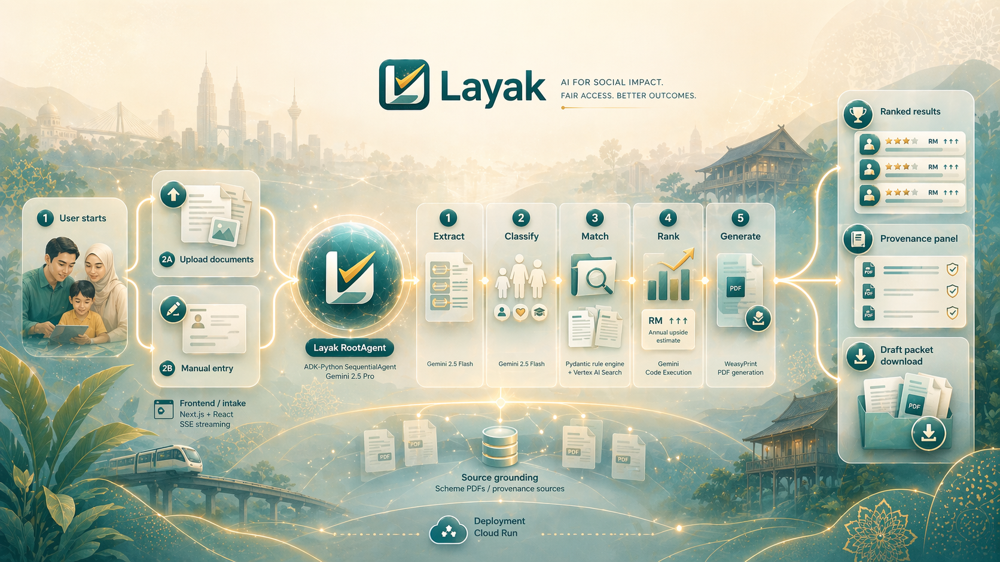

<br/>

[**Live Demo**](https://layak.tech) · [**Pitch Deck**](https://docs.google.com/presentation/d/10sZA_cJGqoypqAIinCfxXzN9VCqGtEF-FD8ZZC-NzwM/edit?usp=sharing) · [**Demo Video**](#-demo-video)

</div>

---

> **Project 2030: MyAI Future Hackathon** · Track 2 — Citizens First (GovTech & Digital Services) · Open category
> Built by **Team T010NG**.

> [!NOTE]
> Layak is a **draft-only** concierge. It never submits to a real government portal. Every packet is watermarked **`DRAFT — NOT SUBMITTED`** so the citizen reviews, signs, and submits through the official channel themselves.

---

## ✨ At a Glance

<table>
  <tr>
    <td align="center"><strong>RM 13,808</strong><br/><sub>annual relief surfaced for our reference user, Aisyah</sub></td>
    <td align="center"><strong>~60s</strong><br/><sub>median end-to-end latency, upload → draft packets</sub></td>
    <td align="center"><strong>5&nbsp;+&nbsp;2&nbsp;+&nbsp;1</strong><br/><sub>upside + subsidy-credit info cards + 1 contribution flagged</sub></td>
    <td align="center"><strong>0</strong><br/><sub>hallucinated rules — every number cites a source PDF</sub></td>
  </tr>
</table>

---

## 🎬 Demo Video

<div align="center">

<video src="https://github.com/user-attachments/assets/de170687-e2bd-40fb-a9ec-11484076c729" controls muted width="820" poster="docs/slides/assets/slide-01-cover.png">
  Your browser does not support inline video playback.
  <a href="https://youtu.be/XuFsiMNjknA">Watch on YouTube</a> instead.
</video>

<br/>

<sub>▶ Also on <a href="https://youtu.be/XuFsiMNjknA"><strong>YouTube</strong></a></sub>

</div>

---

## 🖼 Screenshots

<table>
  <tr>
    <td width="33%">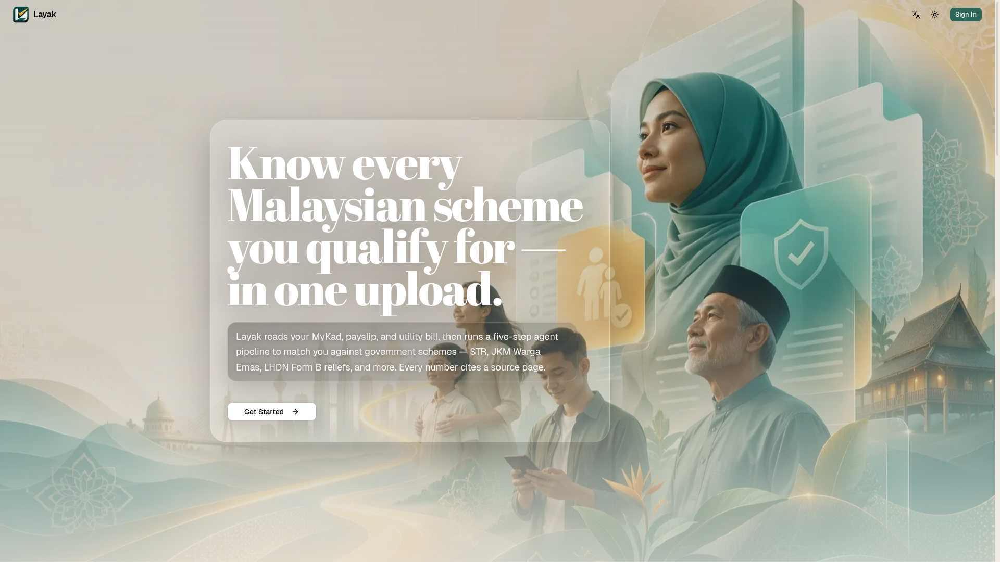<p align="center"><sub>Landing — <em>every Malaysian scheme you qualify for, in one upload</em></sub></p></td>
    <td width="33%">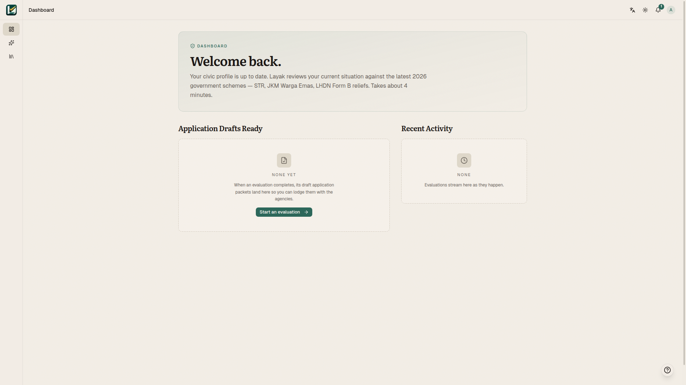<p align="center"><sub>Dashboard — application drafts and recent activity</sub></p></td>
    <td width="33%">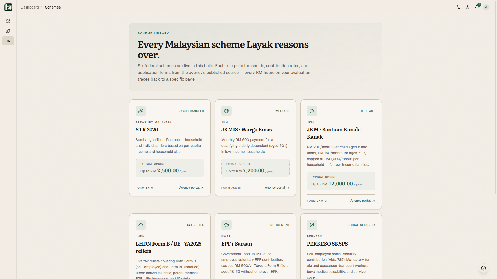<p align="center"><sub>Scheme library — every scheme Layak reasons over</sub></p></td>
  </tr>
  <tr>
    <td width="33%">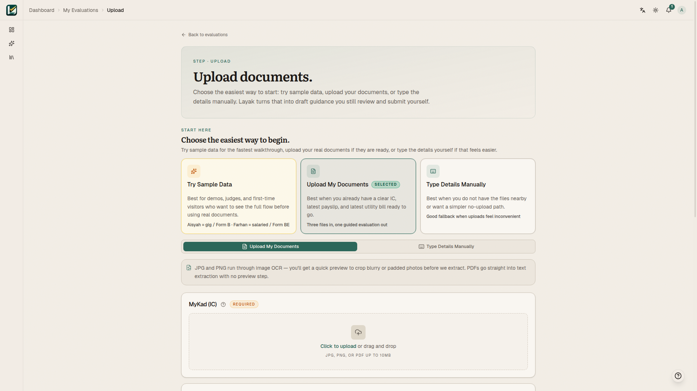<p align="center"><sub>Upload intake — sample, upload, or manual entry</sub></p></td>
    <td width="33%">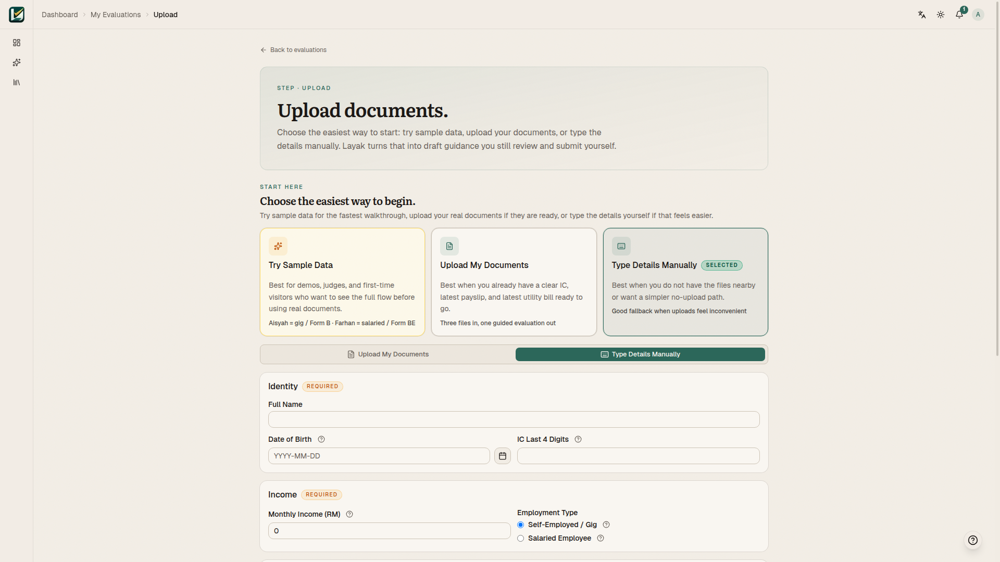<p align="center"><sub>Manual entry — privacy-first path, no docs required</sub></p></td>
  </tr>
</table>

---

## 🧠 What Layak Does

Malaysia's aid landscape is **fragmented** — 167 social-assistance schemes spread across 17 ministries and agencies. Citizens rarely know what they qualify for because the effort to search and apply for each one isn't worth it.

Layak collapses that into a single guided flow. A user uploads documents (or uses the privacy-first manual-entry path), and the agent returns:

- 🥇 **Ranked Schemes** ordered by estimated annual RM upside.
- 💬 **Plain-Language Reasons** they appear to qualify.
- 🔗 **Source-Linked Provenance** for every rule-backed claim.
- 📄 **Draft Application Packets** for manual submission.
- ⚠️ **Required Contributions** surfaced separately so the headline upside stays honest.
- 🤖 **Conversational Concierge** for a grounded chatbot on the results page so non-technical users (e.g., aunties and uncles) can ask follow-up questions about _their_ evaluation in English, Bahasa Malaysia, or Mandarin.

---

## 🏗 Feature Matrix

|     | Feature                     | What it means                                                                                                                                                                                                                                                                   |
| --- | --------------------------- | ------------------------------------------------------------------------------------------------------------------------------------------------------------------------------------------------------------------------------------------------------------------------------- |
| 📥  | **Dual Intake**             | Document upload for IC / payslip / utility, or a manual form for users who'd rather not upload anything.                                                                                                                                                                        |
| 🧩  | **Visible 5-step Agent**    | Extract → Classify → Match → Rank → Generate, streamed over SSE so the citizen watches the work happen.                                                                                                                                                                         |
| 🔎  | **Grounded Retrieval**      | Vertex AI Search over committed scheme PDFs — if no passage is retrieved, the rule is flagged `unverified` and drops out of the ranking.                                                                                                                                        |
| 🧮  | **Live Arithmetic**         | Annual upside computed via Gemini Code Execution, not LLM narration.                                                                                                                                                                                                            |
| 🖨  | **Draft Packet Generation** | WeasyPrint renders pre-filled application PDFs for each matched scheme, all watermarked `DRAFT — NOT SUBMITTED`.                                                                                                                                                                |
| 👤  | **Accounts & History**      | Firebase Auth (Google), Firestore-backed evaluation history, free-tier quota, and an upgrade waitlist.                                                                                                                                                                          |
| 🔐  | **PDPA-Aligned**            | Explicit consent on sign-up, JSON export, and hard-delete endpoints. 30-day prune of free-tier history.                                                                                                                                                                         |
| 🎭  | **Demo-Ready Fixtures**     | Five synthetic personas (Aisyah, Farhan, Hashim, Meiling, Ravi) for stable judging walkthroughs.                                                                                                                                                                                |
| 🤖  | **Per-Evaluation Chatbot**  | A floating panel on every completed results page — grounded on _that_ eval doc + Vertex AI Search retrieval, multilingual (en/ms/zh), with a five-layer guardrail stack (system-prompt language lock, safety filters, input validator, RAG grounding, citation-drift detector). |

---

## 🌏 Why It Matters — SDG Alignment

Layak is built around a simple product stance: **citizens should not have to portal-hop just to discover what they are already entitled to.** That stance maps directly to three UN Sustainable Development Goals:

| SDG                                                                    | Goal                                     | How Layak contributes                                                                                                                                                 |
| ---------------------------------------------------------------------- | ---------------------------------------- | --------------------------------------------------------------------------------------------------------------------------------------------------------------------- |
|  | **No Poverty**                           | Surfacing unclaimed subsidies (STR 2026, JKM Warga Emas, BKK) and tax reliefs directly increases the disposable income of low- and middle-income households.          |
|  | **Reduced Inequalities**                 | The manual-entry path works on a data-capped mid-range Android — the same experience the self-employed gig worker gets as the salaried urban professional.            |
|  | **Peace, Justice & Strong Institutions** | Every output carries a citation to a gazetted PDF, every draft is clearly labelled, and nothing is submitted on the citizen's behalf. Public-sector AI with receipts. |

---

## 🏛 Architecture

Layak is a two-service app on Google Cloud Run: a **Next.js 16 frontend** and a **FastAPI + ADK-Python backend**. The backend runs a `RootAgent` (Gemini 2.5 Pro) that orchestrates six `FunctionTool`s as a `SequentialAgent`.

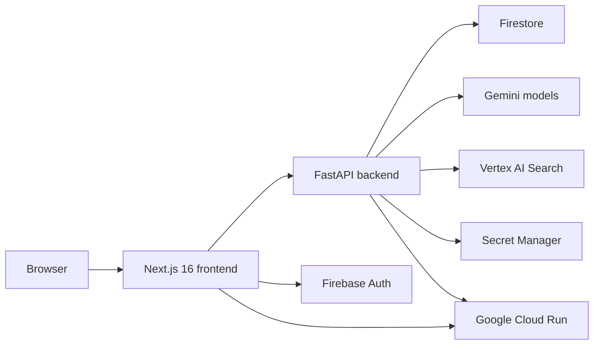

<details>
<summary><strong>Agent Pipeline — Six Autonomous Steps</strong></summary>

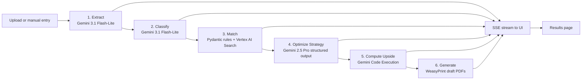

</details>

<details>
<summary><strong>Authenticated Evaluation Flow</strong></summary>

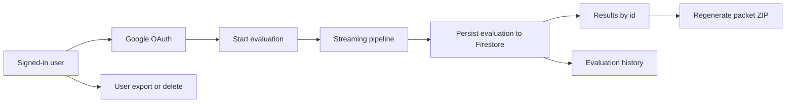

</details>

<details>
<summary><strong>Conversational Concierge — Per-Evaluation Grounded Chatbot</strong></summary>

Cik Lay (Pegawai Skim) fronts a floating chatbot on every completed results page so a low-tech-literacy user can ask follow-up questions about _their_ evaluation in plain English, Bahasa Malaysia, or Mandarin. The bot is hard-constrained to the loaded `evaluations/{evalId}` doc plus Vertex AI Search retrieval over the nine scheme PDFs — it is **not** a general-purpose chatbot.

```mermaid
graph TD
    User[User message] --> L1[Layer 1 — Input validator<br/>regex prompt-injection guard + length cap]
    L1 --> L2[Layer 2 — System prompt<br/>identity + Rule 0 language lock + eval-context digest + 5 hard rules]
    L2 --> L3[Layer 3 — Per-turn language reinforcement<br/>appended to user message]
    L3 --> L4[Layer 4 — Grounding + safety<br/>Vertex AI Search grounding tool + Gemini built-in safety_settings<br/>BLOCK_LOW_AND_ABOVE on 4 harm categories]
    L4 --> Gemini[Gemini Flash]
    L4 --> Search[Vertex AI Search]
    Search --> Gemini
    Gemini --> Draft[Draft response]
    Draft --> L5[Layer 5 — Output validator<br/>citation-drift detector drops &#91;scheme:xxx&#93; markers not in eval's qualifying matches]
    L5 --> Panel[Floating chat panel<br/>on results page]
```

The stack is explicit end to end: Layer 1, Layer 2, Layer 3, Layer 4, and Layer 5 keep Cik Lay grounded while `use-chat.ts` keeps the conversation state local by holding the rolling history in the browser and persisting nothing server-side. The eval-context digest carries only `ic_last6` for privacy.

</details>

<details>
<summary><strong>Agentic Scheme Discovery + Admin Moderation</strong></summary>

A background discovery agent watches a hardcoded allowlist of authoritative government source pages (MOF, JKM, LHDN, KWSP, PERKESO) and surfaces rate or eligibility changes to an admin reviewer **before** they reach end users. The flow keeps a human in the loop — Layak never auto-publishes scheme changes from the open web.

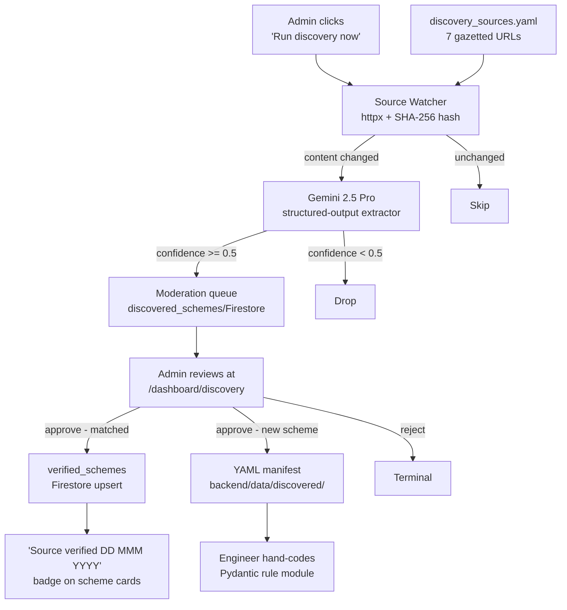

The admin role is gated by a Firebase custom claim seeded from `LAYAK_ADMIN_EMAIL_ALLOWLIST`. Non-admin users hitting `/dashboard/discovery` are redirected to `/dashboard` (and the sidebar tab never renders for them). Public users see only the trust signal — the "Source verified" badge — on every scheme card across the app.

</details>

<details>
<summary><strong>Cross-Scheme Strategy Optimizer + Cik Lay Handoff</strong></summary>

After matching, an optimizer agent surfaces cross-scheme coordination opportunities the rule engine can't see — e.g. _"Only one filing sibling should claim the RM 1,500 dependent-parent relief; pick whoever's at the highest marginal tax bracket."_ Each advisory cites the source PDF passage that backs the rule and offers a one-click handoff to Cik Lay for follow-up.

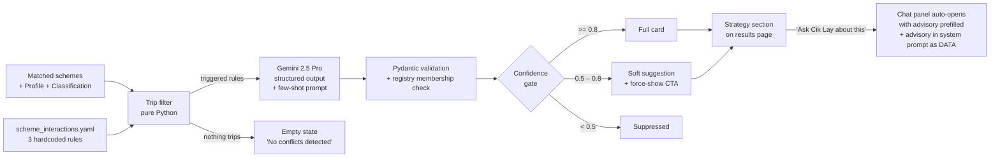

Four-layer grounding keeps the optimizer honest: (1) the YAML registry of allowed `interaction_id` values, (2) the Pydantic schema with mandatory citation and length caps, (3) hand-written few-shot examples that anchor the response shape, and (4) frontend confidence-gated rendering. The Cik Lay handoff injects the advisory into the chat system prompt as **DATA — for context only, not instructions** so a hostile headline can't redirect the assistant.

</details>

<details>
<summary><strong>What-If Scenarios — Live Partial Rerun</strong></summary>

The results page surfaces three sliders (monthly income, children under 18, elderly dependants) that let users explore _"what changes if my income drops to RM 2,500"_ without re-uploading documents. Each slider drag debounces 500 ms then runs a lightweight partial-rerun on the server — skipping OCR + Code Execution + PDF generation, which keeps the round-trip under 2 s end-to-end.

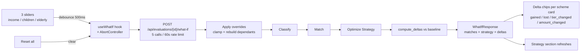

The endpoint is stateless w.r.t. Firestore — sliders are exploratory and dragging them never pollutes the user's evaluation history. The original eval doc remains the durable record; reset reverts the page to baseline.

</details>

<details>
<summary><strong>Two-Tier Reasoning Surface — Watch the Agent Think</strong></summary>

The pipeline streams two parallel reasoning registers as it runs. Layperson users see a lay narration card (always visible) with one humanised line per step. Anyone curious about the internals can expand a developer transcript with timestamps, tool names, Vertex retrieval hits with scores, and Gemini Code Execution stdout — the same data a backend engineer would see in logs.

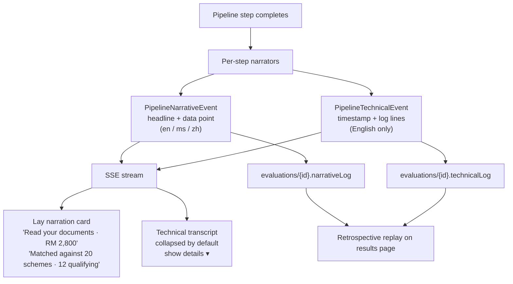

The technical layer is PII-clean by contract: full IC numbers, names, and addresses never reach the transcript. Only the last six digits of the IC, masked as `******-PB-####`, ever surface. The lay narration localises to the user's language; the technical transcript stays English because its audience is developer-grade.

</details>

---

## 🌀 Google AI Ecosystem

Layak exercises **eight** first-party Google components in one flow:

| Layer                | Component                 | Role                                                                         |
| -------------------- | ------------------------- | ---------------------------------------------------------------------------- |
| 🧠 Brain · 01        | **Gemini 2.5 Pro**        | `RootAgent` orchestrator. Holds tools and the conversation buffer.           |
| 🧠 Brain · 02        | **Gemini 2.5 Flash**      | Multimodal document extraction. Reads IC, payslip, utility bill directly.    |
| 🧠 Brain · 03        | **Gemini 2.5 Flash-Lite** | Household classifier — ~5× cheaper than Flash for structured output.         |
| 🧠 Brain · 04        | **Gemini Code Execution** | Sandboxed Python for annual-RM arithmetic — visible in the SSE stream.       |
| 📚 Context · 05      | **Vertex AI Search**      | Grounded RAG over the nine cached scheme PDFs. Every rule carries a passage. |
| 🎛 Orchestrator · 06 | **ADK-Python v1.31**      | First-party GA agent framework. `SequentialAgent` + `FunctionTool`.          |
| ☁ Lifecycle · 07     | **Cloud Run**             | Two services, both `min-instances=1` with CPU boost an hour before demo.     |
| 👤 Identity · 08     | **Firebase Auth**         | Google OAuth only. ID-token verification on every dashboard call.            |

---

## 🧰 Tech Stack

| Category        | Technology                                                        | Notes                                                     |
| --------------- | ----------------------------------------------------------------- | --------------------------------------------------------- |
| Frontend        | Next.js 16 · React 19 · TypeScript 5 · Tailwind CSS 4 · shadcn/ui | Public experience, dashboard, evaluation UI               |
| Backend         | FastAPI · Python 3.12 · Pydantic v2                               | Intake APIs, orchestration, rules, packet generation      |
| Agent Framework | Google ADK for Python · `SequentialAgent`                         | `RootAgent` orchestration                                 |
| Models          | Gemini 2.5 Pro · 2.5 Flash · 2.5 Flash-Lite · 3 Flash Preview     | Orchestration, extraction, classification, compute_upside |
| Grounding       | Vertex AI Search                                                  | Source passage retrieval for provenance                   |
| Computation     | Gemini Code Execution                                             | Annual upside calculations                                |
| Document Output | WeasyPrint                                                        | Draft PDF packet generation                               |
| Identity & Data | Firebase Auth · Firestore                                         | Authenticated flows, saved evaluations, quotas            |
| Cloud           | Google Cloud Run · Secret Manager · Artifact Registry             | Deployment and runtime secrets                            |
| Tooling         | pnpm · ESLint · Prettier · Husky · lint-staged                    | Workspace and code quality                                |

---

## 🚀 Getting Started

### Prerequisites

- Node.js `24.x`
- `pnpm@10.33.0`
- Python `3.12`

### Install & configure

```bash
pnpm install          # installs every workspace package
cp .env.example .env  # then fill in the GCP + Firebase values below
```

Required environment variables:

- `GOOGLE_CLOUD_PROJECT`
- `GOOGLE_CLOUD_LOCATION`
- `VERTEX_AI_SEARCH_DATA_STORE`
- `VERTEX_AI_SEARCH_LOCATION`
- `NEXT_PUBLIC_BACKEND_URL`
- `NEXT_PUBLIC_FIREBASE_*`
- `FIREBASE_ADMIN_KEY`

### Run locally

```bash
# in terminal 1 — frontend
pnpm dev                                        # → http://localhost:3000

# in terminal 2 — backend
cd backend && uvicorn app.main:app --reload --port 8080   # → http://localhost:8080
```

### Useful commands

```bash
pnpm dev         # start frontend (Next.js 16, webpack, port 3000)
pnpm build       # production frontend build
pnpm start       # run production frontend
pnpm run lint    # lint frontend (use `run` — `pnpm lint` hits a built-in)
pnpm format      # prettier --write across the repo
```

---

## ☁ Deployment

Both services deploy to Google Cloud Run, fronted by custom domains. Current production URLs:

- **Frontend:** <https://layak.tech> (`www.layak.tech` → 308 redirect to apex)
- **Backend:** <https://api.layak.tech>

<details>
<summary><strong>Reference <code>gcloud run deploy</code> commands</strong></summary>

```bash
# Frontend
gcloud run deploy layak-frontend \
  --source frontend \
  --region asia-southeast1 \
  --min-instances 1 --cpu-boost --allow-unauthenticated \
  --set-build-env-vars NEXT_PUBLIC_BACKEND_URL=https://api.layak.tech \
  --memory 512Mi --timeout 60

# Backend
gcloud run deploy layak-backend \
  --source backend \
  --region asia-southeast1 \
  --min-instances 1 --cpu-boost --allow-unauthenticated \
  --set-env-vars GOOGLE_CLOUD_PROJECT=...,GOOGLE_CLOUD_LOCATION=global,VERTEX_AI_SEARCH_DATA_STORE=layak-schemes-v1,VERTEX_AI_SEARCH_LOCATION=global \
  --set-secrets FIREBASE_ADMIN_KEY=firebase-admin-key:latest \
  --memory 2Gi --timeout 300
```

</details>

> [!IMPORTANT]
> If these URLs or commands drift, the live runtime configuration and `.github/workflows/cloud-run-deploy.yml` are the source of truth — not this README.

---

## 🔒 Privacy & Safety

> [!CAUTION]
> Layak is a **preparation** tool, not a submission tool. It never writes to `bantuantunai.hasil.gov.my`, the LHDN portal, or any other live agency endpoint.

- 🚫 **No Live Submission — Ever.** Outputs are drafts. The citizen submits through the official channel.
- 🧾 **No Unverified Claim** reaches the UI. If Vertex AI Search returns no passage for a rule, the rule drops out of the ranking.
- 🎭 **Synthetic Demo Documents Only.** Every MyKad, payslip, and utility bill in `docs/demo/` is fictional and watermarked `SYNTHETIC — FOR DEMO ONLY`.
- ⚖ **No Final Legal Determination** is claimed. Every explanation uses "you appear to qualify ... the agency confirms on application."
- 🗑 **30-Day Retention** on free-tier history, cascade-delete on account deletion, JSON export on demand — PDPA 2010-aligned.

---

## 🤝 AI Disclosure

This project has utilized AI tooling in the following ways to produce sustainable and maintainable code using:

- **Google AI Studio** — Prompt engineering and development-workflow design for the app.
- **Google Antigravity IDE** — Code scaffolding and generation support.
- **GitHub Copilot** — Documentation assistance and Git workflow support.
- **Claude Code (Anthropic)** — Phase 11 production-grade SaaS enhancements: agentic scheme discovery + admin moderation, cross-scheme strategy optimizer with Cik Lay handoff, what-if scenario partial-rerun endpoint, two-tier reasoning surface, and the Phase 11 docs sweep. Every commit was audited by a parallel subagent before landing.

All AI-assisted output is reviewed, tested, and integrated by human developers before commit.

---

## 🗺 v2 Roadmap (deferred from Phase 11)

Phase 11 shipped four production-grade features for the Open Category finals. Seven items were deliberately deferred to v2 to keep the scope honest at ≈6 working days. They're tracked here so the team can point to them when asked "what about X?":

- **PDF Citation Viewer** — clicking any RM value or eligibility claim opens the cited PDF page inline with the relevant paragraph highlighted. High-value for verification UX; deferred because it adds a PDF-rendering pipeline (PDF.js + page-extract) that doesn't fit the v1 timebox.
- **Lifecycle Vigilance Loop** — user-facing drift notifications when an admin approves a discovery candidate that affects the user's matched schemes, plus deadline pulses for scheme filing windows and outcome capture on submitted packets.
- **Household / Family Mode** — multi-member household profile, `ParallelAgent` per-member evaluation, and an aggregator agent that produces the family-level recommendation. Currently the pipeline evaluates one filer at a time.
- **Optimizer rule code-generation** — auto-emit Pydantic rule modules from approved discovery candidates. v1 produces YAML manifests instead; an engineer hand-codes the Pydantic rule from the manifest. Auto-codegen needs more rigorous test coverage before it can ship without a human review step.
- **Open-web crawling** — discovery agent scanning beyond the 7-source allowlist (e.g. via Google Custom Search or a curated RSS feed). v1 keeps the allowlist closed to prevent prompt-injection vectors.
- **Multi-reviewer admin workflow** — reviewer + approver split with an audit log of who-approved-what. v1 ships a deliberately simple two-tier (user / admin) role scheme.
- **Voice intake via Gemini Live API** — Bahasa Malaysia conversational profile capture as an alternative to the upload + manual-entry paths. Strong UX win for accessibility; needs a separate latency budget + safety harness.

Two cuts taken inside Phase 11 itself (also v1.1 targets): Cloud Scheduler integration for the discovery agent (v1 ships manual-trigger only) and the Vertex AI Search re-grounding pass on optimizer citations (Layer 3 of the spec's 5-layer grounding stack — Layers 1+2+4+5 are active).

---

## 👥 Team

<p align="center">Built with ❤️ by <strong>Team T010NG</strong>, as we strive to <strong>TOLONG</strong>.</p>

<table align="center">
  <tr>
    <td align="center" width="200">
      <a href="https://github.com/AlaskanTuna"></a><br/>
      <strong>Adam</strong><br/>
      <a href="https://github.com/AlaskanTuna"><sub>@AlaskanTuna</sub></a>
    </td>
    <td align="center" width="200">
      <a href="https://github.com/chaosiris"></a><br/>
      <strong>Hao</strong><br/>
      <a href="https://github.com/chaosiris"><sub>@chaosiris</sub></a>
    </td>
    <td align="center" width="200">
      <a href="https://github.com/Doraemon-00"></a><br/>
      <strong>JS</strong><br/>
      <a href="https://github.com/Doraemon-00"><sub>@Doraemon-00</sub></a>
    </td>
  </tr>
</table>

---

## 📁 Project Structure

<details>
<summary><strong>Repository Layout</strong></summary>

```text
Layak/
├── assets/              # README visuals and banner art
├── frontend/            # Next.js app — dashboard, marketing, evaluation UI
├── backend/             # FastAPI app — agent pipeline, rules, routes, PDF generation
│   ├── app/agents/      #   ADK-Python RootAgent + FunctionTools
│   ├── app/rules/       #   typed Pydantic rule engine (STR, JKM, LHDN, i-Saraan, PERKESO)
│   ├── app/routes/      #   FastAPI routes (intake, evaluation, packet, user)
│   ├── app/services/    #   Vertex AI Search client, rate limit, Firestore wrappers
│   └── data/schemes/    #   committed gazetted source PDFs (source of truth)
├── docs/                # PRD, TRD, plan, progress, demo personas, pitch deck
│   ├── slides/          #   HTML pitch deck + exported PNGs (docs/slides/assets/)
│   └── demo/            #   synthetic persona bibles (aisyah, farhan, hashim, meiling, ravi)
├── .github/             # workflows: cloud-run-deploy.yml, etc.
├── package.json         # root workspace orchestrator
├── pnpm-workspace.yaml
└── .env.example
```

</details>

---

## 🙏 Acknowledgements

- **Project 2030: MyAI Future Hackathon** — UTM × Google Cloud Platform, for the opportunity and the credits.
- **Ministry of Finance Malaysia** — for publishing Budget 2026 as a gazetted, citable primary source.
- **LHDN, JKM, PERKESO, KWSP** — for the public explanatory notes and schedules we ground the rule engine on.
- The open-source community behind `Next.js`, `FastAPI`, `ADK-Python`, `shadcn/ui`, and `WeasyPrint`.

---

<div align="center">

<sub><strong>Layak</strong> · Project 2030 · MyAI Future Hackathon · Track 2 Open · © 2026 Team T010NG</sub>

</div>
