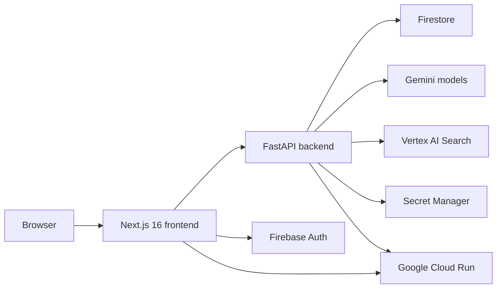
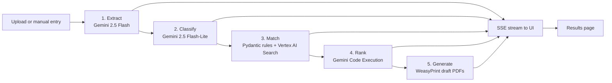
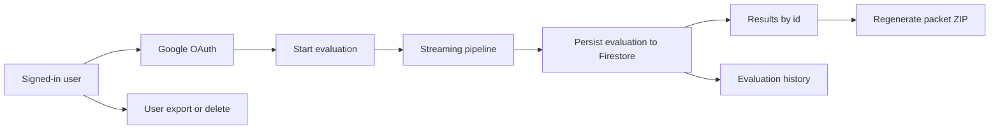

<h1 align="center">Layak</h1>

<p align="center">
  An agentic AI concierge for Malaysians to discover social-assistance schemes,<br/>
  estimate annual upside, and generate draft application packets with visible provenance.
</p>

<p align="center">
  
  
  
  
  
  
</p>


> **Submission For:** Project 2030: MyAI Future Hackathon;
> **Track 2:** Citizens First (GovTech and Digital Services);
> **Category:** Open

---

## What Layak Does

Malaysia's aid landscape is fragmented across agencies, forms, and portals. A citizen who may qualify for multiple schemes often has to discover each one separately, interpret different eligibility rules, and resubmit the same information multiple times.

Layak turns that into one guided flow. A user can upload supporting documents or choose a privacy-first manual entry path, then receive:

- Matched schemes ranked by estimated annual RM upside.
- Plain-language reasons they appear to qualify.
- Source-linked provenance for rule-backed claims.
- Downloadable draft application packets for manual submission.

Matched schemes are ranked by estimated annual RM upside, while required contributions are surfaced separately so the headline benefit total stays honest.

Layak is intentionally draft-only. It does not submit to government systems on the user's behalf.

---

## Features

- Document upload flow for IC, income, and utility files.
- Manual entry mode for users who prefer not to upload sensitive documents.
- Five-step visible agent pipeline: extract, classify, match, rank, generate.
- Ranked eligibility results ordered by estimated annual RM upside.
- Source-backed provenance for rule-driven outputs.
- Draft packet generation for supported schemes and tax-relief summaries.
- Google sign-in, dashboard, and persisted evaluation history.
- Free-tier quota controls with upgrade waitlist flow.
- PDPA-aligned export and account deletion endpoints.
- Demo personas and fixture documents for stable judging walkthroughs.

---

## Why It Matters

Layak is built around a simple product stance: citizens should not have to portal-hop just to discover what they are already entitled to. The system uses a safer AI pattern than a generic chatbot by grounding eligibility logic in committed source materials, surfacing citations in the UI, and stopping at draft generation instead of live submission.

That combination improves trust, clarity, and preparation while still demonstrating a practical "AI to action" workflow for public-service discovery.

---

## High-Level Architecture

Layak is a two-service application: a Next.js frontend and a FastAPI backend, both deployed to Google Cloud Run. The backend runs a RootAgent built on ADK-Python with a five-step pipeline for extraction, classification, matching, ranking, and packet generation.



<details>
<summary><strong>Agent Pipeline</strong></summary>



</details>

<details>
<summary><strong>Authenticated Evaluation Flow</strong></summary>



</details>

---

## Google AI Ecosystem

Layak is built around the Google AI stack the hackathon calls for:

- `Gemini 2.5 Pro` for orchestration.
- `Gemini 2.5 Flash` and `Gemini 2.5 Flash-Lite` for extraction and classification.
- `Vertex AI Search` for grounded retrieval and provenance.
- `Gemini Code Execution` for visible upside calculations.
- `Cloud Run`, `Firebase Auth`, `Firestore`, and `Secret Manager` for deployment, auth, persistence, and secrets.

---

## Tech Stack

| Category        | Technology                                                    | Notes                                                |
| --------------- | ------------------------------------------------------------- | ---------------------------------------------------- |
| Frontend        | Next.js 16, React 19, TypeScript 5, Tailwind CSS 4, shadcn/ui | Public experience, dashboard, evaluation UI          |
| Backend         | FastAPI, Python 3.12, Pydantic v2                             | Intake APIs, orchestration, rules, packet generation |
| Agent Framework | Google ADK for Python, `SequentialAgent`                      | RootAgent orchestration                              |
| Models          | Gemini 2.5 Pro, Gemini 2.5 Flash                              | Orchestration, extraction, classification            |
| Grounding       | Vertex AI Search                                              | Source passage retrieval for provenance              |
| Computation     | Gemini Code Execution                                         | Annual upside calculations                           |
| Document Output | WeasyPrint                                                    | Draft PDF packet generation                          |
| Identity & Data | Firebase Auth, Firestore                                      | Authenticated flows, saved evaluations, quotas       |
| Cloud           | Google Cloud Run, Secret Manager                              | Deployment and runtime secrets                       |
| Tooling         | pnpm, ESLint, Prettier, Husky                                 | Workspace and code quality                           |

---

## Getting Started

### Prerequisites

- Node.js `24.x`
- `pnpm@10.33.0`
- Python `3.12`

### Installation

```bash
pnpm install
```

### Configure Environment Variables

```bash
cp .env.example .env
```

Important values include:

- `GOOGLE_CLOUD_PROJECT`
- `GOOGLE_CLOUD_LOCATION`
- `VERTEX_AI_SEARCH_DATA_STORE`
- `VERTEX_AI_SEARCH_LOCATION`
- `NEXT_PUBLIC_BACKEND_URL`
- `NEXT_PUBLIC_FIREBASE_*`
- `FIREBASE_ADMIN_KEY`

### Run Locally

Frontend from the repo root:

```bash
pnpm dev
```

Backend from `backend/`:

```bash
uvicorn app.main:app --reload --port 8080
```

Local defaults:

- frontend: `http://localhost:3000`
- backend: `http://localhost:8080`

### Useful Commands

```bash
pnpm dev      # start frontend
pnpm build    # production frontend build
pnpm start    # run production frontend
pnpm lint     # lint frontend
pnpm format   # format repo files
```

---

## Deployment

Current deployed URLs referenced in the repo:

- Frontend: `https://layak-frontend-297019726346.asia-southeast1.run.app`
- Backend: `https://layak-backend-297019726346.asia-southeast1.run.app`

Cloud Run deployment examples documented for this project:

- Frontend:
  `gcloud run deploy layak-frontend --source frontend --region asia-southeast1 --min-instances 1 --cpu-boost --allow-unauthenticated --set-build-env-vars NEXT_PUBLIC_BACKEND_URL=https://layak-backend-297019726346.asia-southeast1.run.app --memory 512Mi --timeout 60`
- Backend:
  `gcloud run deploy layak-backend --source backend --region asia-southeast1 --min-instances 1 --cpu-boost --allow-unauthenticated --set-env-vars GOOGLE_CLOUD_PROJECT=...,GOOGLE_CLOUD_LOCATION=global,VERTEX_AI_SEARCH_DATA_STORE=layak-schemes-v1,VERTEX_AI_SEARCH_LOCATION=global --set-secrets FIREBASE_ADMIN_KEY=firebase-admin-key:latest --memory 2Gi --timeout 300`

If these URLs or commands drift, treat the runtime configuration and deployment scripts as the source of truth.

---

## Privacy & Safety

- Layak does not submit to live government portals.
- Outputs are clearly draft-only and meant to help users prepare, not bypass agency review.
- Rule-backed claims surface provenance instead of asking users to trust a hidden model decision.
- Uploaded documents are processed for evaluation, while authenticated flows persist evaluation records and user account data needed for history, quota, and PDPA actions.
- The product includes export and deletion capabilities for signed-in users.
- Demo documents in the repository are synthetic and intended for demonstrations only.

---

## AI Disclosure

In line with the hackathon handbook requirement to disclose AI-generated code and AI-assisted development, this project used AI tooling in the following ways:

- `Google AI Studio` for prompt engineering and designing development workflow.
- `Google Antigravity IDE` for code scaffolding and generation support.
- `GitHub Copilot` for documentation assistance and Git workflow support.

All AI-assisted output is reviewed and integrated by human developers before commit. If the team decides to disclose additional assistants used during development, this section should be extended only with accurate, project-specific statements.

---

## Project Structure

<details>
<summary><strong>Repository Layout</strong></summary>

```text
Layak/
|-- assets/              # README visuals and generated banner art
|-- frontend/            # Next.js app, dashboard, marketing pages, evaluation UI
|-- backend/             # FastAPI app, agent pipeline, rules, routes, PDF generation
|-- docs/                # PRD, TRD, handbook notes, plans, diagrams, demo materials
|-- .github/             # GitHub workflows and repo metadata
|-- package.json
|-- pnpm-workspace.yaml
`-- .env.example
```

</details>

---
