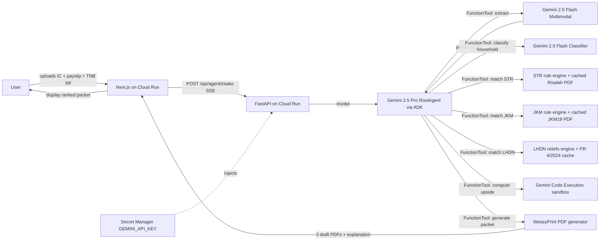

# Layak — Project Research Brief

*Agentic AI concierge for Malaysian social-assistance discovery. Submission target: Project 2030 — MyAI Future Hackathon, Track 2 (Citizens First), Open category. Prepared 20 April 2026 for a 24-hour build window, two-developer team.*

---

## Pre-flight corrections to the locked concept

Three verified facts contradict assumptions in the original concept. They do **not** change the locked schemes, persona, or agentic moment, but the build must account for them:

1. **JKM Warga Emas is RM600/month from Budget 2026, not RM500.** Announced as an uplift from RM500. We cannot find a gov.my PDF yet showing RM600 explicitly (the federal JKM scheme page was last touched in 2019 and Sabah's BOT page still shows RM350 — a different, state-funded scheme). Treat RM600 as the Budget-announced figure and cite the Budget 2026 speech; keep RM500 as a fallback in case the aggregated reporting is wrong.
2. **LHDN has 22 personal relief line-items for YA2025, not 11.** The "11" number appears to be legacy. Verified list at https://www.hasil.gov.my/en/individual/individual-life-cycle/income-declaration/tax-reliefs/.
3. **Aisyah as a Grab driver files Form B (business income), not Form BE (salaried).** Form BE is for salaried employees. Form B is due 30 June 2026 (grace 15 July). The demo can still *show* Form BE as the target (the user might moonlight from a salaried job) or pivot to Form B. We recommend **explicitly framing Aisyah as "self-employed gig worker filing Form B"** and claiming personal reliefs on that form — the relief catalogue is identical; only the form route differs.

---

## 1. Project background

Malaysia's social-assistance estate is the textbook definition of fragmented. The **Ministry of Finance's Economic Outlook 2024**, released 13 October 2023 alongside Budget 2024, stated that "the fragmented nature of social assistance programmes involving **167 schemes that are currently being implemented by 17 ministries and agencies**" had produced "overlapping programmes causing both inclusion and exclusion errors." (https://www.mof.gov.my/portal/en/news/press-citations/economic-outlook-2024-need-for-review-reform-and-redesign-of-social-assistance-delivery; primary PDF https://belanjawan.mof.gov.my/pdf/belanjawan2024/economy/economy-2024.pdf). Khazanah Research Institute and Bank Negara have independently described the same estate as "small and fragmented, often with irregular and inadequate benefits" (https://krinstitute.org/Publications-@-Building_Resilience-;_Towards_Inclusive_Social_Protection_in_Malaysia.aspx). Derek Kok in Malay Mail quantifies it at ~RM17.1 billion/year across 60+ programmes with roughly a 33% exclusion error for the extreme-poor under the old BR1M regime (https://www.malaymail.com/news/what-you-think/2024/10/25/budget-2025-and-social-protection-new-coat-of-paint-on-a-rusty-machine-derek-kok/154831).

The policy direction since mid-2023 has been consolidation. **Ekonomi MADANI**, launched 27 July 2023, frames its agenda as "Raising the Ceiling / Raising the Floor," with Raising the Floor covering quality of life, social mobility, and inclusive development (https://www.mof.gov.my/portal/en/news/press-citations/madani-economy-to-boost-malaysian-economy-improve-quality-of-life-pm-anwar). The **13th Malaysia Plan (2026–2030)**, tabled 31 July 2025 (https://rmk13.ekonomi.gov.my/), reuses the same three pillars and targets 95% of federal services online by 2030 (https://www.digital.gov.my/en-GB/siaran/Kementerian-Digital-Akan-Menggiatkan-Inisiatif-RMK-13). **MyDIGITAL Blueprint** (2021, https://www.mydigital.gov.my/) placed digital transformation of the public sector as Thrust 1 but pre-dates the agentic-AI era.

The most immediate policy anchor for Layak is the **Polisi Pendigitalan Data Sektor Awam (PPDSA)**, launched by Digital Minister Gobind Singh Deo on **10 February 2026** at Seri Pacific Hotel, Kuala Lumpur alongside the MyGDX data-exchange expansion (https://www.digital.gov.my/en-GB/siaran/Revolusi-Digital-Sektor-Awam:PPDSA-Dan-MyGDX-Pemacu-Transformasi-Rakyat). At the launch Gobind said PPDSA's success **"paves the way for utilization of Agentic AI, which will be supported by a workforce of competent and digitally skilled civil servants"** (https://www.digitalnewsasia.com/business/malaysia-officially-launches-its-public-sector-data-policy-8-years-after-mygdx-pilot) and tied it to the "Once-Only Principle — where citizens would no longer need to repeatedly submit physical documents to different agencies." Supporting statutory backdrop: the **Data Sharing Act 2025 (Act 864)**, gazetted April 2025.

What exists today is portal-shaped, not agent-shaped. **MyGov portal** (https://www.malaysia.gov.my/) and the **MyGov Malaysia super-app** (beta 20 Aug 2025) aggregate 34 federal services but the super-app's own in-house AI chatbot was quietly disabled **one day after launch** after it confidently named ministers into the wrong portfolios and mis-stated RON95 prices (https://www.malaymail.com/news/tech-gadgets/2025/08/21/mygov-quietly-shuts-down-ai-chatbot-after-it-starts-talking-nonsense/188445; https://soyacincau.com/2025/08/20/mygov-beta-ai-chatbot-shut-down-nonsense-answers/). Secretary-General Fabian Bigar later confirmed the shutdown on-record: "This highlighted the need for more rigorous training and clear operational boundaries for our AI models" (https://theedgemalaysia.com/node/786989). The **Bantuan Tunai Rahmah portal** (https://bantuantunai.hasil.gov.my/) runs STR applications; **SARA** (https://sara.gov.my/en/home.html) delivers MyKad-credited basic-goods aid through MyKasih; **PADU** (https://padu.gov.my/) holds household socio-economic data but has been criticised by Penang Institute for duplicating EPF/STR/LHDN data and exposing citizens to PDPA gaps (https://penanginstitute.org/publications/issues/an-inquisition-into-malaysias-padu-subsidy-targeting-and-beyond/). The closest native analog, **Ihsan MADANI** (https://ihsanmadani.gov.my/), is a static questionnaire with no document understanding.

**Why this is judge-resonant.** The hackathon rewards "Chat → Action." Malaysia has, on the public record, a failed generative chatbot (Aug 2025), a Minister pointing at agentic AI as the next layer (Feb 2026), and a formal fragmentation problem statement from the MOF (Oct 2023). Layak sits exactly at that intersection: it is not a chatbot that was shut down; it is the autonomous layer the Minister named, delivered on a persona the Budget 2026 tier tables explicitly target.

## 2. Problem statements

**Primary problem — discovery failure caused by supply-side fragmentation.** Malaysia runs 167 social-assistance schemes across 17 ministries with overlapping eligibility and siloed application flows, producing both inclusion and exclusion errors (Economic Outlook 2024). A citizen who would qualify for three or four schemes today must discover them on separate portals, decode separate eligibility rubrics, and submit separate documents — work that the state, not the citizen, should be doing.

**User-level problem — Aisyah cannot get past the first form.** Aisyah is a 34-year-old Grab driver in Kuantan with two school-age children and a 70-year-old dependent father. She earns ~RM2,800/month in gig income. She has a MyKad, an e-wallet payslip-equivalent, and a TNB bill. To claim what she is already entitled to — STR cash tier, her father's Warga Emas eligibility review, and the LHDN reliefs that would pull her tax liability toward zero — she needs to navigate three distinct portals, interpret RM-threshold tables, figure out which relief line items attach to her persona (parent medical, child under 18, self-employed EPF via i-Saraan), and re-enter the same three documents into three different forms. In practice she does none of it.

**Sovereignty / ecosystem problem — Malaysia is mid-transition from chatbots to agentic AI and needs a public reference implementation.** PPDSA was launched two months ago explicitly to pave the way for agentic AI in public-sector delivery. The MyGov Malaysia chatbot was disabled after producing hallucinated advice. The 13MP's Once-Only Principle is policy-stated but operationally unproven at the citizen-facing layer. Building a grounded, verifiable agent that cites its rules and never executes live transactions demonstrates a safer pattern Malaysia's public sector can adopt — and answers the hackathon's Impact & Problem Relevance rubric with a direct line to current national priorities.

## 3. Project aim and objectives

**Aim.** To demonstrate, in a 24-hour hackathon build, that an agentic AI concierge grounded in a small, auditable corpus of Malaysian government eligibility rules can reduce the discovery and application effort for three Budget-2026-era social-assistance schemes from hours of portal-hopping to a single document-upload interaction that yields a pre-filled, signed draft application packet.

**Objectives.**
1. **Design** a five-step agent pipeline (extract → classify household → cross-reference → rank by annual RM upside → generate packet) that runs autonomously from a single user interaction and maps one-to-one to the "Chat → Action" rubric axis.
2. **Develop** a grounded rule engine encoding STR 2026 tier logic, JKM Warga Emas means-test logic, and five LHDN personal reliefs relevant to the Aisyah persona, with every rule traceable to a cached source PDF URL.
3. **Develop** a multimodal document-intake layer using Gemini 2.5 Flash to extract profile data directly from IC, payslip, and utility-bill images, without a separate OCR stage.
4. **Demonstrate** end-to-end on Google Cloud Run with min-instances=1, measurable first-byte latency under 3 seconds during the judging window, and a zero-hallucination rule-provenance layer (every eligibility claim cites its source PDF).
5. **Demonstrate** use of at least four Google AI ecosystem components — Gemini 2.5 Pro (orchestrator), Gemini 2.5 Flash (workers), Gemini Code Execution (arithmetic), and Cloud Run + Secret Manager (deployment).
6. **Evaluate** on one outcome metric visible in the demo: estimated annual RM upside per user relative to "did nothing" (e.g., Aisyah's RM7,250/year from STR + SARA + three LHDN reliefs). This becomes the headline number in the pitch.

## 4. Target users

**Primary persona — Aisyah, 34, Grab driver, Kuantan (locked).** Two school-age children (ages 7 and 10 — both under 18, both trigger child relief 16a). One dependent father, 70, resident in household. Monthly gig income approximately RM2,800, no fixed employer, no EA Form — files **Form B**, not Form BE. Digital literacy: moderate — confident with e-wallet apps, photo-uploads MyKad when Grab asks, distrustful of multi-page government forms. Current aid status: likely already receives SARA monthly MyKad credit; unclear whether she has applied for STR 2026; father not yet enrolled in Warga Emas; has never claimed parent-medical relief under LHDN. Device: mid-range Android, data-capped mobile plan, occasional WiFi at home. Language: prefers Bahasa Malaysia; functional English. Pain point in one sentence: *"I don't know what I'm entitled to, the forms all want the same documents twice, and I don't trust that entering my IC number anywhere online is safe."*

**Secondary personas (out-of-scope for v1, listed for positioning only).**
- **Encik Rahman, 68, retired lorry driver, Kedah.** Qualifies for Warga Emas + STR senior tier. Demonstrates the elderly-only flow.
- **Siti, 29, kindergarten teacher, Selangor, salaried RM3,200/month.** Files Form BE; benefits primarily from LHDN reliefs + STR household tier if married with kids.
- **Vinod, 52, small-workshop owner, Johor.** Files Form B; illustrates complex i-Saraan + EPF voluntary contribution routing.

**User assumptions.** Owns a smartphone with a working camera; has intermittent mobile data; cannot reliably assume home broadband; prefers Bahasa Malaysia text but can read English UI if copy is plain; trust-posture is skeptical after the MyGov chatbot incident and broader scam landscape — therefore Layak must display "we store nothing" and "draft only — you submit manually" prominently.

**Why Aisyah is the only demo persona.** She activates all three locked schemes simultaneously (STR household tier with children, Warga Emas through her father, and LHDN reliefs matching her gig profile), producing the richest three-scheme packet in a 90-second demo. Secondary personas each light up only one or two schemes and would dilute the on-stage "aha." Building a persona switcher is the #1 scope-creep trap; it is out.

## 5. In scope / out of scope

**In scope for v1 (demo-night deliverables, 10 features).**
1. Single-page Next.js web app deployed at a Cloud Run HTTPS URL, English UI only.
2. Document-upload widget accepting three image/PDF files (IC, payslip or e-wallet income screenshot, utility bill).
3. Gemini 2.5 Flash multimodal extraction into a strict JSON profile (name, IC last-4, age, monthly income, dependants, household composition flags).
4. Hard-coded eligibility rule engine for STR 2026 (household-with-children tier), JKM Warga Emas, and five LHDN reliefs (individual, parent medical, child 16a ×2, EPF/life under #17, lifestyle #9).
5. Gemini Code Execution arithmetic step computing annual RM upside per scheme + total.
6. Ranked scheme list in the UI ordered by RM upside.
7. Provenance panel: every rule cites its source PDF URL (cached locally, linked from UI).
8. PDF packet generator producing three pre-filled drafts (BK-01 copy, JKM18 copy, LHDN relief summary) watermarked "DRAFT — NOT SUBMITTED."
9. "Why I qualify" explanation per scheme, generated by the Gemini 2.5 Pro orchestrator referencing the provenance map.
10. Hard-coded Aisyah seed data button for demo fallback if live extraction misbehaves.

**Out of scope (explicit, broader than in-scope).** Live submission to any government portal (disqualification risk and outside hackathon rules); Malay/Chinese/Tamil UI; other schemes including **i-Saraan, PERKESO, MyKasih, eKasih, PADU sync, state-level aid (Kita Selangor, Penang elderly), SARA claim flow** — these are shown as greyed-out cards labelled "Checking… (v2)"; appeal workflow (BK-02/BK-05 or JKM20); mobile native app; user accounts and persistent storage; MyDigital ID / MyKad NFC reading; multi-document versioning; email/WhatsApp delivery of packet; voice input; OKU, spouse, disability edge cases in rule engine; EV charging, SSPN, housing loan interest reliefs; tax filing submission to MyTax; PADU registration; household income percentile framing against OpenDOSM data; Budget 2026 SARA Untuk Semua one-off; eKasih booster tier toggle; Warga Emas discretionary-override path; Form B vs Form BE auto-routing.

**Emergency de-scope at hour 18.** If pipeline is not stable by hour 18/24, the cut list is, in order: (a) drop PDF packet generation, replace with an on-screen "pre-filled form preview" panel; (b) drop Gemini Code Execution arithmetic, compute upside in Python directly; (c) drop two of the five LHDN reliefs; (d) drop live document extraction entirely, use the hard-coded Aisyah seed data as the "user uploaded these documents" flow. The demo still wins on "Chat → Action" provided steps 1–5 of the agentic moment execute visibly on stage.

## 6. Data and documents — sourcing strategy

Every URL below has been confirmed reachable via search results or direct fetch during research. The bold verification notes call out where third-party sites differ from primary government sources.

### 6a. STR (Sumbangan Tunai Rahmah) — Budget 2026

- **Primary eligibility source:** *Risalah STR 2026* infographic PDF, https://bantuantunai.hasil.gov.my/FAQ/RISALAH%20STR%202026.pdf (linked from the portal homepage; fetched 20 Apr 2026; no explicit last-updated date in the file, but branded "STR 2026").
- **Application form:** BK-01, https://bantuantunai.hasil.gov.my/Borang/BK-01%20(Borang%20Permohonan%20&%20Kemaskini%20STR%202026).pdf.
- **SARA anchor:** https://sara.gov.my/en/home.html; MOF benefits directory https://manfaat.mof.gov.my/b2026/individu/str2026 (domain live; direct fetch blocked by bot protection).
- **Tier summary used for rule encoding (household with children category):** ≤RM2,500 household income → RM1,000 to RM2,500 depending on number of children; RM2,501–5,000 → RM500 to RM1,250. SARA monthly credit on MyKad stacks: RM100/month for standard STR households, RM200/month if registered in eKasih, one-off RM100 "SARA Untuk Semua" disbursed 9 Feb 2026.
- **Encoding difficulty: 4/5.** Drivers: the Bujang (single) RM600 cash was *removed* in 2026 and replaced by SARA monthly credit; households can stack STR + monthly SARA + one-off SARA; categories are mutually exclusive (a senior with a qualifying child files as Household, not Warga Emas). Do not double-count.
- **Gotcha list:** stale content on third-party sites still shows Bujang RM600 cash; strsara.my is **not** a government site and does **not** host BK-01; hard registration deadlines (13 Oct–28 Nov 2025 for full-year Phase 1) have passed so any live appeal goes through BK-01/BK-02 as update-kemaskini.
- **Warning for the brief:** the task prompt's claim that "strsara.my hosts BK-01" is wrong. Strsara.my is an affiliate content site. The canonical BK-01 is at bantuantunai.hasil.gov.my.

### 6b. JKM Warga Emas (BWE / Bantuan Warga Emas)

- **Primary scheme page:** JKM federal warga-emas page at http://www.jkm.gov.my/jkm/index.php?id=dmp5dm5raUhvVSt6SVk4MWRmZkswdz09&r=portal%2Fleft (confirmed via search; last revised 2019).
- **Application form:** JKM18, https://www.jkm.gov.my/jkm/uploads/files/Bahagian%20PW/BORANG%20PERMOHONAN%20JKM%2018%20(2022)(1).pdf with mirror https://ebantuanjkm.jkm.gov.my/spbkDoc/BorangJKM/JKM18.pdf (2022 version still current; ebantuanjkm domain live but bot-protected).
- **Rate as of April 2026:** **RM600/month under Budget 2026** (uplift from RM500). Multiple aggregator confirmations, but **no gov.my PDF yet updated** with the RM600 figure at the time of this research. Cite Budget 2026 speech and keep a safe fallback in UI copy that references "RM500–600/month depending on current gazetted rate."
- **Eligibility:** Malaysian citizen resident in Malaysia, age ≥60, household income below the per-household or per-capita **PGK Miskin Tegar** (hardcore poverty line); 2024 PLI = RM2,705 and food-PLI = RM1,236 per DOSM (https://www.dosm.gov.my/portal-main/release-content/poverty-in-malaysia-2024); not residing in JKM institutional care; in-person verification within 14 days of online application.
- **Encoding difficulty: 4/5.** Two reasons: dual means test (household OR per-capita — rule engine should pass either), and discretionary state-director override for "sebatang kara" edge cases. For Aisyah's father, use the per-capita path (RM2,800 income / 4 household members ≈ RM700/capita, well below RM1,236 food-PLI) to produce a clean qualification signal.
- **Gotcha list:** Sabah BOT is a separate **state** scheme at RM350 — do not conflate; JKM18 still dated 2022 despite Budget uplift; applicant must physically appear at PKMD within 14 days.

### 6c. LHDN Form BE reliefs — YA2025 (filing window open now)

- **Filing programme:** https://www.hasil.gov.my/media/fqog1423/rf-filing-programme-for-2026.pdf. Form BE e-filing open 1 March 2026; deadline 30 April 2026 (grace 15 May). **Form B** (gig/self-employed, Aisyah's actual form) deadline 30 June 2026, grace 15 July.
- **Explanatory notes BE 2025:** https://www.hasil.gov.my/media/pshpbomm/explanatorynotes_be2025_2.pdf.
- **Reliefs master table (authoritative):** https://www.hasil.gov.my/en/individual/individual-life-cycle/income-declaration/tax-reliefs/.
- **Public Ruling correction:** the task prompt cites "Public Ruling 3/2024" — that PR is actually "Tax Borne by Employers" (https://www.hasil.gov.my/media/cynnw2lz/public-ruling-no-3_2024-tax-borne-by-employers.pdf), not the relief reference. The correct canonical relief ruling is **Public Ruling 4/2024 — Taxation of a Resident Individual Part I: Gifts or Contributions and Allowable Deductions**, https://www.hasil.gov.my/media/d2wh4ykj/pr-no-4-2024.pdf. Also relevant: PR 7/2025 (education fees), https://www.hasil.gov.my/media/0jbegsui/pr-7-2025.pdf.
- **Number of reliefs: 22 line-items for YA2025, not 11.** Several caps increased in YA2025 (disabled self RM6k→7k, disabled spouse RM5k→6k, intellectual-disability child RM4k→6k, education/medical insurance RM3k→4k) plus a new relief #22 for first-home housing-loan interest.
- **Recommended reliefs for Aisyah (v1 scope, locked 5):** (1) Individual & dependent relatives RM9,000; (2) Parent medical/special needs/carer up to RM8,000; (3) Child under 18 RM2,000 ×2 = RM4,000; (4) EPF + life insurance under #17 up to RM7,000 (route to i-Saraan voluntary contribution); (5) Lifestyle RM2,500. Total relief ceiling addressed ~ RM30,500.
- **Encoding difficulty: 5/5** — 22 categories, nested sub-caps (RM1,000 dental inside RM10,000 serious-disease; RM1,000 medical-exam inside RM8,000 parent), YA-specific amount changes, and BE-vs-B form routing. Only the five locked reliefs are encoded in v1.
- **YA2025 vs YA2026 sanity check:** Form filed in 2026 = YA2025 reliefs. Budget 2026 relief changes apply to YA2026 (filed in 2027). Lock the rule engine to YA2025.

### 6d. Supplementary datasets (framing, not rule-critical)

- **OpenDOSM household income by state:** https://data.gov.my/data-catalogue/hh_income_state. API `https://api.data.gov.my/data-catalogue?id=hh_income_state`. Parquet mirror `https://storage.dosm.gov.my/hies/hh_income_state.parquet`.
- **Percentile dataset (B40/M40/T20 framing):** https://data.gov.my/data-catalogue/hies_malaysia_percentile.
- **Poverty dataset (hardcore-poverty line for JKM):** https://data.gov.my/data-catalogue/hh_poverty.
- **Use pattern:** fetch parquet mirrors over `storage.dosm.gov.my` rather than hitting the live API — the CDN-cached files survive a crowded demo network; the live API endpoints returned permission errors during research.

### 6e. Document templates for the demo

- **EA Form specimen (employer earnings):** https://phl.hasil.gov.my/pdf/pdfborang/EA_Pin2021_2.pdf (template C.P. 8A). Use as visual reference for synthetic payslip.
- **TNB utility bill:** **no official specimen PDF** found on tnb.com.my. Generate a synthetic bill from observed layouts; never use real account/meter numbers.
- **MyKad synthetic card:** Governed by PDPA 2010 and National Registration Regulations 1990. NRD has publicly stated that sharing any real MyKad photo violates PDPA (https://www.nst.com.my/news/nation/2018/05/368184/nrd-says-dont-spread-mykad-photo-woman-viral-pic-malaysian-citizen; https://www.freemalaysiatoday.com/category/nation/2025/06/10/security-guards-have-no-authority-to-demand-scan-mykad-says-jpn). Safe pattern: fully fictional IC number, watermark "SAMPLE — SYNTHETIC — FOR DEMO ONLY," AI-generated face disclosed as such, no holographic/chip replication (that crosses into forgery territory under the Penal Code). State on slide 1 of the pitch deck: *"Synthetic document. Not a real MyKad. No real personal data used."*

### Top three data-sourcing risks and mitigations

1. **Third-party aggregator drift on STR numbers.** Sites like strsara.my, bantuanstrsara.my, ecentral.my publish near-correct but sometimes-stale Budget 2026 figures. *Mitigation:* cache `RISALAH STR 2026.pdf` and `sara.gov.my` content at project start; run all rule lookups from the cache; show the source PDF URL in the provenance panel for every claim.
2. **YA confusion in tax reliefs.** "Tax filed in 2026" = YA2025; "Budget 2026 relief changes" = YA2026 (filed 2027). Mixing them produces a wrong annual-upside number live on stage. *Mitigation:* hard-code the relief table as a versioned JSON keyed by `ya_2025`; reject anything else at import.
3. **Government portals rate-limiting or bot-blocking at demo time.** ebantuanjkm.jkm.gov.my, manfaat.mof.gov.my, and api.data.gov.my all returned permission errors to our fetcher during research despite being live in a browser. *Mitigation:* ship with all source PDFs and all DOSM parquet files **bundled inside the container**; treat live-URL fetches as optional enrichment, never as critical path.

## 7. Tech stack and Google AI ecosystem integration

### Mandatory Google components

**Gemini 2.5 Pro — RootAgent orchestrator.** GA, 1M-token context, PDF-native (https://ai.google.dev/gemini-api/docs/models/gemini, https://ai.google.dev/gemini-api/docs/pricing). Pricing $1.25/$10 per 1M in/out at ≤200K prompt tokens. It holds the system prompt, the tool registry (extract, classify, match, rank, generate), the three cached scheme PDFs inline (~50–80K tokens), and the conversation buffer. Context budget plan: ~90K tokens of PDFs + ~5K system prompt + ~15K user/tool transcript ≈ 110K, comfortably inside the cheap tier. Fallback: Gemini 2.5 Flash if Pro rate-limits.

**Gemini 2.5 Flash — worker agents.** GA, 1M context, $0.15 in / $0.60 out. Used for bulk IC/payslip/utility-bill multimodal extraction, per-scheme eligibility classification, and ranking. Flash over Pro because the workload is latency-sensitive (the demo should feel fast), token-heavy in short bursts, and does not need deep reasoning — extraction and classification tasks are essentially structured-output work where Flash's speed dominates. Also: using Pro for extraction would burn the context window before orchestration even starts.

**Gemini Code Execution.** Built-in tool on 2.5 Pro/Flash/Flash-Lite, enabled with `tools: [{codeExecution: {}}]` (https://ai.google.dev/gemini-api/docs/code-execution). Sandboxed Python, 30-second limit, numpy/pandas bundled. Used on stage for three specific computations judges will see: (1) STR tier lookup given household income + child count → annual RM cash; (2) JKM Warga Emas per-capita means test (household income ÷ members vs PLI); (3) LHDN tax liability delta (gross income − standard reliefs × tax bracket). The value is not the arithmetic — it is that judges see Python run, not hallucinated numbers.

**Vertex AI Search — skip for v1.** Verified overkill for a 3-PDF / ~80-page corpus. Setup (data store + engine + IAM + indexing) eats 2–4 hours. Sessions/Memory/Code Execution billing started 11 Feb 2026. Instead, use **Gemini 2.5 Pro's 1M context with PDFs inline** as the grounded-RAG substitute. If a judge specifically asks "is that RAG?", answer: "inline-context grounding over a 3-PDF corpus — Vertex AI Search adds cost and latency at this corpus size without improving retrieval precision."

**Orchestration layer — Google ADK-Python (not Genkit).** ADK-Python is GA at v1.31 (https://pypi.org/project/google-adk/, https://github.com/google/adk-python). Genkit-Python is still Alpha at v0.5 with a known "Event loop is closed" bug on warm Cloud Run instances (https://github.com/genkit-ai/genkit/issues/4925). Deploy command is confirmed: `adk deploy cloud_run --with_ui` (https://google.github.io/adk-docs/deploy/cloud-run/). Primitives confirmed present: `FunctionTool`, `LlmAgent`, `SequentialAgent`, `ParallelAgent`. **Migration from ADK-TypeScript:** the team's prior experience is in ADK-TS with Zod schemas and 4-layer prompt assembly. ADK-Python mirrors the same concept tree: `FunctionTool` maps 1:1, Pydantic replaces Zod, and `SequentialAgent` replaces hand-rolled chaining. Expected migration tax: 3–4 hours of re-learning + schema rewrites. Net: still cheaper than adopting Alpha Genkit-Python cold.

**Google Cloud Run.** Deploy with `adk deploy cloud_run --with_ui` (ADK packages the container), or `gcloud run deploy --source .` for the Next.js frontend. **Set `--min-instances=1` from 1 hour before the demo slot** (https://docs.cloud.google.com/run/docs/configuring/min-instances) to eliminate cold start; pair with `--cpu-boost`. Free tier is generous enough for the whole hackathon (2M requests/month).

**Secret Manager.** Store `GEMINI_API_KEY` as a secret, mount as env var: `gcloud run deploy SERVICE --set-secrets=GEMINI_API_KEY=gemini-api-key:latest` (https://docs.cloud.google.com/run/docs/configuring/services/secrets). Grant `roles/secretmanager.secretAccessor` to the Cloud Run service account.

### Supporting, non-Google, open-source

**Frontend — Next.js 14 App Router.** Recommended over SvelteKit/Nuxt/plain React because (a) `next start` deploys directly to Cloud Run with buildpacks, (b) server components let the upload route stream directly to the FastAPI agent endpoint, (c) the team already knows the idiom. Use shadcn/ui + Tailwind for speed. Copy GOV.UK's question-page pattern (https://design-system.service.gov.uk/patterns/question-pages/) for trust signalling.

**Backend — FastAPI.** Python 3.12, async, pairs cleanly with ADK-Python. Single `/api/agent/intake` POST endpoint that accepts three multipart files, pipes to the RootAgent, streams the response back as Server-Sent Events so the UI can show each agent step landing live — this is the "agentic moment" made visible.

**PDF generation — WeasyPrint.** HTML+CSS to PDF, versus ReportLab's imperative API. WeasyPrint because the team can reuse the Next.js component styles as the PDF template; ReportLab forces a parallel drawing API. Caveat: Cloud Run container needs `libpango`, `libcairo`, `libgdk-pixbuf` — add to Dockerfile early.

**Document OCR — Gemini 2.5 multimodal direct, no Tesseract.** Tesseract needs preprocessing, language packs, and accuracy tuning; Gemini 2.5 Flash reads IC/payslip/utility-bill images directly into a structured JSON in one call. Accepted tradeoff: marginally more cost per doc ($0.0001-class) in exchange for ~2 hours of pipeline work saved and significantly higher extraction quality on messy phone-camera photos.

### Architectural sketch

### Feasible-minimum tech stack (Plan B at hour 12)

If Vertex AI Search or ADK-Python orchestration is fighting the team at hour 12: **collapse to Gemini 2.5 Pro with all three scheme PDFs dropped inline into a single system prompt, every step orchestrated by a thin FastAPI Python script with three sequential `generate_content` calls, no ADK abstractions.** The 1M-token context absorbs all three PDFs with ~900K tokens to spare. Cost per demo run ≈ RM0.50. The "five agentic steps" are then distinct LLM calls with tool-result messages between them, still visibly sequential in the UI's SSE stream. This preserves the agentic moment and keeps judging rubric defensible.

## 8. Prior art and similar projects

| Project | Type | What it solves | What Layak should copy | What Layak should avoid |
|---|---|---|---|---|
| **Ihsan MADANI** (https://ihsanmadani.gov.my/) | Malaysian government pilot | Static ~1-minute form matching users to cost-of-living aid across 7 NACCOL clusters; deep-links to each agency's portal | NACCOL 7-cluster taxonomy; "we store nothing" copy; direct "Mohon di sini" outbound linking | No document understanding, no income extraction, no ranked upside, no explanation — exactly the UX gap Layak fills |
| **SupportGoWhere Singapore** (https://supportgowhere.life.gov.sg/) | Government | Eligibility checker + scheme directory; multilingual | "Fewest-questions" principle; split of auto-inclusion vs. apply-needed; card layout for schemes | GovTech found only ~20% of visitors used the checker — don't over-engineer the questionnaire side |
| **MyScheme India** (https://www.myscheme.gov.in/) | Government (Digital India) | 2,500+ schemes, 3-step profile → match → outbound apply, DigiLocker SSO | Scheme-as-marketplace metaphor; category taxonomy; identity-SSO analog (MyDigital ID in Malaysia) | Pure attribute-match with no verification layer — user still has to prove eligibility at each agency |
| **entitledto / Turn2us UK** (https://www.entitledto.co.uk/, https://benefits-calculator.turn2us.org.uk/) | Commercial + charity | Means-tested calculation with "better-off" scenario comparison | Detailed RM-upside calculation rather than yes/no; scenario comparison as a v2 feature | Dated UI, heavy account registration, hard exclusion list that turns users away |
| **USA.gov Benefit Finder** (https://www.usa.gov/benefit-finder) | Government | Life-event framing (new baby, job loss) across 1,000+ programs | Life-event framing is mentally stickier than agency-name framing | Benefits.gov itself was sunsetted for underuse — lesson: discovery alone is not enough, packet-delivery is the value-add |
| **google/adk-samples** (https://github.com/google/adk-samples) | OSS reference | Official ADK agents including llm-auditor, auto-insurance-agent, hierarchical-workflow-automation | The `sub_agents=[]` coordinator pattern maps directly to extract→classify→match→rank→generate | Demo-only disclaimer — don't ship samples unmodified |
| **LlamaIndex LlamaExtract / LlamaParse** (https://www.llamaindex.ai/blog/introducing-llamaextract-beta-structured-data-extraction-in-just-a-few-clicks) | OSS + hosted | Schema-inferred PDF → JSON extraction | Event-driven agent workflows, per-document-type schema routing | Free tier caps (5 files, 10pp/file) — we bypass by using Gemini Flash multimodal directly |
| **Code for America Benefits Playbook** (https://codeforamerica.org/resources/benefits-playbook/) | Civic-tech research | Evidence-based benefits UX patterns from 6M+ households | Plain language, mobile-first, photo-of-doc upload, guest flow | Don't force account registration; don't require ID proofing up-front |
| **GOV.UK Design System** (https://design-system.service.gov.uk/) | Design reference | Accessible question-page, error-summary, check-your-answers patterns | Copy the check-your-answers summary page verbatim for final eligibility review | Visual austerity — soften for B40 consumer audience |
| **NYC MyCity chatbot** (https://themarkup.org/news/2024/03/29/nycs-ai-chatbot-tells-businesses-to-break-the-law) | Failed government pilot | $600K Azure-OpenAI chatbot that advised illegal actions (Section 8 discrimination, tip skimming) | The disclaimers they added are a floor; must do better | Do NOT deploy hallucinating LLMs on laws/regs without hard-coded rule lookups, cited sources, and a red-team pass |

**Single most useful reference — Ihsan MADANI.** It is the direct Malaysian predecessor, proves the government accepts centralised aid discovery as a premise, and stops exactly where Layak picks up: it does no document understanding, no ranking, no explanation, no packet. Positioning Layak as "Ihsan MADANI + agentic doc intake + conversational explanation" is a non-competitive, policy-aligned framing judges will recognise.

**Single most cautionary tale — NYC MyCity chatbot.** Launched October 2023, confidently told users employers could skim tips and landlords could reject Section 8 vouchers (https://themarkup.org/news/2024/03/29/nycs-ai-chatbot-tells-businesses-to-break-the-law); shutdown announced by incoming Mayor Mamdani in November 2025 (https://statescoop.com/mamdani-kill-nyc-ai-chatbot/). What killed it: generic RAG-over-LLM on a `.gov` domain with no hard-coded rule engine, no domain-expert red team, and procurement optimised for launch speed. The lesson embedded in Layak's architecture: every eligibility claim cites a source PDF, the rule engine is hard-coded with numeric thresholds (not "inferred" by the LLM), the final legal determination is always "agency confirms on application," and the packet is stamped DRAFT. Malaysia's own MyGov chatbot (Aug 2025) is the same lesson closer to home.

## 9. Key risks and mitigations

| # | Risk | Likelihood | Demo impact | Mitigation |
|---|---|---|---|---|
| 1 | Scheme rule encoded wrong, judge catches it during Q&A | Medium | Submission-killing credibility hit | Encode only the five locked reliefs + STR household tier + Warga Emas per-capita path; pin all three scheme PDFs into the repo; show the source-URL + page-ref for every rule in the provenance panel; rehearse Q&A with the PDFs open |
| 2 | Cloud Run cold start during 90-second demo | Medium | First-byte latency 8–15s kills the pitch | Set `--min-instances=1` and `--cpu-boost` one hour before slot; ping the health endpoint every 30s during the five-minute warm-up |
| 3 | Gemini rate-limit mid-demo | Low–Medium | Pipeline stalls visibly | Pre-warm with two dry runs; hold a **cached Aisyah result JSON** that a "demo mode" button replays if the live call errors; `min-instances=1` pre-initialises the API client |
| 4 | Vertex AI Search setup eats 4 hours | High if attempted | Loses a quarter of the build window | Do not use Vertex AI Search in v1; use Gemini 2.5 Pro inline-PDF grounding (this is Plan A, not a fallback) |
| 5 | Document extraction flaky on synthetic demo docs | Medium | User-visible extraction errors undermine "Chat → Action" | Hand-design the three demo docs for clean OCR (high contrast, no shadows); keep the hard-coded Aisyah seed button as a one-click fallback |
| 6 | Scope creep past feature freeze at hour 20 | High | Half-built features break the demo | Strict feature-freeze at hour 20; any bug found after that is logged, not fixed, unless it breaks the core five-step flow |
| 7 | Synthetic MyKad looks too real, attracts PDPA/NRD scrutiny | Low | Reputational risk post-demo | Prominent "SYNTHETIC — FOR DEMO ONLY" watermark; fictional IC number; AI-generated face disclosed; slide-1 disclosure in deck |
| 8 | Budget 2026 figures revised between now and demo night | Low | Rule engine numbers outdated | Cite Risalah STR 2026 PDF with date-stamp; frame upside as "estimate based on Budget 2026 gazetted rates as of 20 Apr 2026" |

## 10. Feasibility verdict

**GREEN, conditional on one dependency: ADK-Python migration from the team's ADK-TS baseline must land inside the first 4 hours.** Everything else downstream — FastAPI endpoint, multimodal extraction, inline-PDF grounding, Code Execution arithmetic, WeasyPrint PDF generation, Cloud Run deploy — is well-trodden ground and each piece is individually 1–3 hours for an experienced team. If ADK-Python fights P1, the Plan-B collapse to a thin FastAPI-plus-three-sequential-Gemini-calls architecture (Section 7) preserves the agentic moment and remains buildable inside the window. The three locked schemes are scoped tightly enough that the rule engine is essentially five numeric thresholds and five relief caps, all traceable to cached PDFs. The demo persona activates all three schemes in one flow, producing a natural 90-second narrative arc with a single headline RM-upside number. Against the hackathon's "Chat → Action" rubric axis, the architecture is specifically designed to show five autonomous steps landing live on screen through SSE.

**If we only have time for ONE polish item at hour 23, it should be the provenance panel — every rule and every number in the generated packet must visibly cite its source PDF URL with a click-to-open link.** This single feature is what separates Layak from the NYC MyCity / MyGov Malaysia chatbot failure mode, and it is the specific credibility beat that answers the judge question "how do we know the agent didn't hallucinate this?"

---

## What Claude Code needs to know before scaffolding

- **Three schemes are locked: STR 2026 household-with-children tier, JKM Warga Emas (treat rate as RM600/month per Budget 2026), and five specific LHDN reliefs (individual, parent medical, child 16a ×2, EPF+life #17, lifestyle #9) — not 11 reliefs, not Form BE exclusively; Aisyah the gig worker files Form B, reliefs catalogue is identical.**
- **Orchestration layer is ADK-Python v1.31 GA, deployed via `adk deploy cloud_run --with_ui`; do NOT use Firebase Genkit (Python SDK is Alpha with a known warm-instance bug on Cloud Run); do NOT use Vertex AI Search (overkill for 3 PDFs — use Gemini 2.5 Pro 1M context with PDFs inline).**
- **Model routing: Gemini 2.5 Pro as RootAgent orchestrator with all three cached scheme PDFs inline (~80K tokens, well under the 200K cheap tier); Gemini 2.5 Flash for multimodal doc extraction and per-scheme classification; Gemini Code Execution (`tools: [{codeExecution: {}}]`) for on-stage arithmetic of annual RM upside.**
- **Never execute live submissions. Output is a signed PDF draft packet watermarked "DRAFT — NOT SUBMITTED." Every eligibility claim must cite a source PDF URL in the UI — this is the single most important differentiator from the NYC MyCity and MyGov Malaysia chatbot failures, and it is the hour-23 polish priority.**
- **Hard feature freeze at hour 20/24. Cached Aisyah-seed-data button is a required demo-mode fallback. Cloud Run `--min-instances=1 --cpu-boost` must be set at least one hour before the demo slot. Out-of-scope items (i-Saraan, PERKESO, MyKasih, multi-language, user accounts, live submission, appeal flow) render as greyed-out "Checking… (v2)" cards — do not attempt them.**